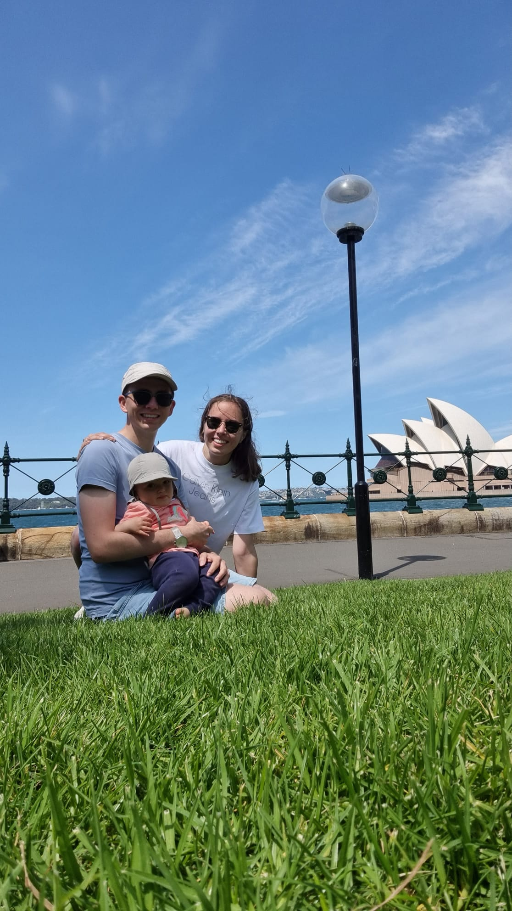

Hallo meine liebsten Mausis!

Inzwischen ist Edda wohl wieder aus der Kita zurück, vielleicht schläft sie auch schon?

Ich hoffe, sie hatte ganz viel Spaß und auch du, Mausimama, hast einen schönen Vormittag gehabt.

## Erinnerung

Nehmt euch doch kurz die Zeit und denkt an diesen tollen Tag zurück. Das ist schon fast ein halbes Jahr her - verrückt, oder?

## Song für Mama

Ist dir eigentlich klar, dass du mir alles im Leben bedeutest und ich eigentlich nur dich (und deine kleine Edda) brauche, um glücklich zu sein?

<iframe width="560" height="315" src="https://www.youtube.com/embed/AWOhx6R6Rhg?si=MXpjjAVQmrww4gC4" title="YouTube video player" frameborder="0" allow="accelerometer; autoplay; clipboard-write; encrypted-media; gyroscope; picture-in-picture; web-share" referrerpolicy="strict-origin-when-cross-origin" allowfullscreen></iframe>

## Song für Edda
Hat Edda vielleicht Lust zu tanzen? 

<iframe width="560" height="315" src="https://www.youtube.com/embed/epux_7utGkY?si=dOn4BM1DZovCU6DQ" title="YouTube video player" frameborder="0" allow="accelerometer; autoplay; clipboard-write; encrypted-media; gyroscope; picture-in-picture; web-share" referrerpolicy="strict-origin-when-cross-origin" allowfullscreen></iframe>

***

Genießt den Nachmittag zusammen - und hoffentlich kann Mama nachher zum Sport!  Ich denk an euch - Papabär 🐻
